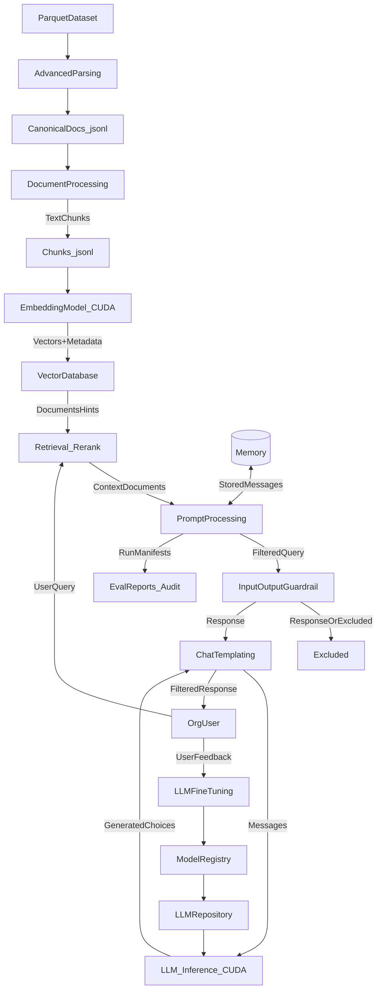

# Legal RAG System Plan (Local-only, LangChain)

## Guiding principles
- **Local-only by default**: no network calls required for ingestion, indexing, retrieval, generation, or evaluation.
- **Explicit artifacts**: each phase produces versioned outputs that become the next phase’s inputs.
- **Legal-specific constraints**: preserve **citations**, **traceability**, **redaction/PII controls**, and **deterministic reproducibility** for audits.
- **GPU acceleration where it matters**: use NVIDIA CUDA for embedding, reranking, and (optionally) local LLM inference.
- **Vietnamese-first**: prioritize Vietnamese legal text quality (segmentation, normalization, retrieval signals, prompts, and eval datasets).

## Target end-to-end flow (artifacts)

**How this maps to phases**:
- `AdvancedParsing` + `DocumentProcessing`: Phase 1–2 (Parquet normalize → VN legal structure → chunk/enrich)
- `EmbeddingModel_CUDA` + `VectorDatabase`: Phase 3
- `Retrieval_Rerank`: Phase 4 (hybrid + VN segmentation + reranker)
- `InputOutputGuardrail` + `PromptProcessing` + `ChatTemplating` + `LLM_Inference_CUDA`: Phase 5
- `EvalReports_Audit`: Phase 6–7 (offline eval + legal audit trail)
- `UserFeedback` → `LLMFineTuning` → registries: optional continuous improvement loop (Phase 6+)

## Phase 0 — Foundation & conventions (you already have most of this)
- **Goal**: lock conventions for data formats, config, and interfaces so later phases are “plug-and-play”.
- **Inputs**: repo scaffold (current codebase is a template to be replaced as phases are implemented).
- **Outputs**:
  - **Config contract**: YAML + env schema (builds on [`src/legal_rag/core/settings.py`](src/legal_rag/core/settings.py)).
  - **Data contracts**: Pydantic models for `Document`, `Chunk`, `RetrievedChunk`, `Answer` (builds on [`src/legal_rag/core/models.py`](src/legal_rag/core/models.py)).
- **Tools/libraries**:
  - `pydantic`, `pydantic-settings` (already in [`pyproject.toml`](pyproject.toml)).
- **Strategy**:
  - Define **versioned corpus schema** (`schema_version`, `doc_id`, `chunk_id`, `source_path`, `page`, `span`, `hashes`).
  - Add **run manifests** for reproducibility: hash of inputs, config, model IDs.

## Phase 1 — Legal document ingestion (Parquet-only)
- **Goal**: convert Parquet-only Vietnamese legal inputs into a canonical text+metadata representation.
- **Inputs**:
  - **Parquet datasets only**: Parquet files/datasets containing extracted Vietnamese legal text plus metadata.
- **Outputs**:
  - `canonical_docs.json` (or JSONL): per-doc text + metadata (jurisdiction, date, title, parties if known, source URI/path, file hash).
  - `extraction_report.json`: extraction quality metrics (pages extracted, empty pages, OCR confidence if applicable).
- **Tools/libraries (local-only)**:
  - Parquet: `pyarrow` or `polars` for IO; optionally `duckdb` for fast local SQL over Parquet shards.
  - Vietnamese NLP (optional but recommended): `underthesea` or `pyvi` for word segmentation/tokenization; `vncorenlp`/`trankit` if you need POS/NER at scale.
- **Strategies**:
  - **Vietnamese normalization**: Unicode NFC normalization, whitespace normalization, consistent punctuation; preserve diacritics.
  - **Legal structure parsing (VN)**: detect and persist structure fields like `Điều` (article), `Khoản` (clause), `Điểm` (point), `Chương` (chapter), `Mục` (section), and `Phụ lục` (appendix) into metadata for chunking/retrieval filters.
  - **De-dup**: detect identical docs by content hash.
  - **Parquet schema mapping**: define a stable mapping from Parquet columns to canonical document fields and store row lineage for audit.

## Phase 2 — Chunking + legal-aware enrichment
- **Goal**: create retrievable units that preserve legal citations and clause boundaries.
- **Inputs**: `canonical_docs.json`.
- **Outputs**:
  - `chunks.jsonl` (your current direction aligns with [`data/processed/corpus.jsonl`](README.md)).
  - `chunk_stats.json`: distribution of chunk sizes, clause boundary hit-rate.
- **Tools/libraries**:
  - LangChain text splitters (`RecursiveCharacterTextSplitter`, and optionally `MarkdownHeaderTextSplitter`).
  - Vietnamese segmentation/tokenization: `underthesea` or `pyvi` (use for BM25 tokenization and optional sentence splitting).
  - Tokenization (local): prefer tokenizer aligned with your embedding/LLM model; use char fallback when needed.
- **Strategies**:
  - **Chunk by Vietnamese legal structure**: split on `Điều/Khoản/Điểm` boundaries first; fallback to sentence/token/char windows.
  - **Context windows for citations**: retain small pre/post context around `Điểm`/`Khoản` boundaries to avoid losing meaning.
  - **Attach rich metadata** per chunk: `{doc_id, source_path, page_range, section_path, clause_number, jurisdiction, created_at, content_hash}`.
  - **Redaction layer** (optional but common in legal): pre-chunk PII detection + masking (local spaCy model or regex policy).

## Phase 2.5 — High-volume Parquet ingestion path (optional, recommended if most inputs are Parquet)
- **Goal**: support scalable, streaming ingestion from Parquet while producing the same canonical/chunk artifacts as file-based extraction.
- **Inputs**: Parquet dataset(s) (partitioned datasets allowed), plus a column mapping configuration.
- **Outputs**:
  - `canonical_docs.jsonl` (streamed) with deterministic `doc_id`s
  - `chunks.jsonl` with stable `chunk_id`s and full lineage metadata
  - `parquet_ingest_manifest.json`: dataset paths, partition filters, row counts, schema snapshot, and mapping used
- **Tools/libraries**:
  - `pyarrow.dataset` or `polars.scan_parquet` for streaming/lazy reads
  - `duckdb` for SQL sampling, backfills, and incremental updates
- **Strategies**:
  - **Partition-aware filtering**: apply matter/jurisdiction/date filters at scan time to reduce cost.
  - **Row lineage**: store `{parquet_path, row_group, row_number, partition_values}` in metadata for audit.
  - **Deterministic IDs**: derive `doc_id` from a stable source key (e.g., `case_id+document_id`) or from `{source_key, normalized_text_hash}`.

## Phase 3 — Embeddings + vector index (local)
- **Goal**: build a persistent vector store + docstore.
- **Inputs**: `chunks.jsonl`.
- **Outputs**:
  - `vector_index/` (persisted)
  - `docstore.sqlite` (or `docstore.jsonl`) for chunk text + metadata
  - `index_manifest.json` (embedding model ID, dim, normalization, build time)
- **Tools/libraries (local-only)**:
  - **Embeddings model (Vietnamese priority)**: `sentence-transformers` on CUDA, preferring strong multilingual models that perform well on Vietnamese.
    - Recommended starting points: `intfloat/multilingual-e5-large` or `BAAI/bge-m3`.
    - Use instruction-style embedding prompts if supported (e.g., `query: ...` / `passage: ...`).
    - Fallback: Vietnamese-specific encoder (e.g., PhoBERT-based) if multilingual underperforms on your legal domain.
  - **Vector store** options:
    - FAISS (CPU baseline; optionally FAISS-GPU for very large corpora/search throughput)
    - Chroma (local persistent) for convenience
    - SQLite/duckdb + HNSW (advanced)
- **Strategies**:
  - **Deterministic builds**: pin model versions; store model name + commit hash.
  - **Metadata filtering**: store fields required for later filters (jurisdiction/date/doc_type).
  - **GPU batching**: embed chunks in batches sized to GPU VRAM; checkpoint progress for large corpora.
  - **Incremental indexing**: append new Parquet partitions/matters without full rebuild; update `index_manifest.json` with segment lineage.

## Phase 4 — Retrieval (hybrid, legal tuned)
- **Goal**: high-precision retrieval with robust recall.
- **Inputs**:
  - `vector_index/`
  - runtime query
- **Outputs**:
  - `retrieval_result.json` per query: topK chunks + scores + applied filters
- **Tools/libraries**:
  - LangChain retrievers
  - BM25 lexical retriever (local) as complement (e.g., `rank-bm25`) with Vietnamese segmentation
- **Strategies**:
  - **Hybrid retrieval**: vector + BM25, then fuse (RRF).
  - **Query rewriting (VN legal)**: normalize variants like `điều/Điều`, `khoản`, `điểm`; expand common Vietnamese legal synonyms; preserve exact citations when query contains “Điều X” patterns.
  - **Reranking (Vietnamese priority)**: GPU reranker with strong Vietnamese/multilingual performance (e.g., `BAAI/bge-reranker-v2-m3`) and boosts for metadata matches on `Điều/Khoản/Điểm`.

## Phase 5 — Generation (local LLM) + citation grounding
- **Goal**: produce answers that are grounded, cite sources, and avoid hallucinations.
- **Inputs**:
  - `retrieval_result.json` (contexts)
  - query + optional constraints (jurisdiction/date)
- **Outputs**:
  - `answer.json`: `{answer_text, citations:[{chunk_id, source_path, page_range}], reasoning_trace(optional)}`
- **Tools/libraries (local-only)**:
  - Local LLM runtime (choose later):
    - **Ollama** (recommended default for simplicity; uses NVIDIA GPU when available)
    - **llama.cpp** (GGUF; good for fully embedded deployments; can use CUDA via cuBLAS builds)
  - LangChain chat model wrappers for Ollama / llama.cpp.
- **Strategies**:
  - **Strict prompt contract**: answer must quote/cite chunk IDs; if insufficient evidence, say so.
  - **Context packing**: prioritize by (rerank score, diversity across docs, clause boundaries).
  - **Safety**: disclaimers (“not legal advice”), refusal logic for unsupported questions.
  - **Vietnamese output policy**: answer in Vietnamese by default; preserve legal terminology; when possible cite using `Điều/Khoản/Điểm` fields from chunk metadata.

### Phase 5A — Prompt processing + guardrails (matches diagram blocks)
- **Goal**: implement `PromptProcessing`, `Input/Output Guardrail`, and `ChatTemplating` as explicit, testable steps.
- **Inputs**:
  - `UserQuery`, `ContextDocuments`, optional conversation state, and policy config
- **Outputs**:
  - `filtered_query.json` (optional debug artifact)
  - `llm_messages.json` (prompt + packed contexts + system policies)
  - `filtered_response.json` (post-guardrail response)
  - `run_manifest.json`: model IDs, index manifest ID, chunk IDs, prompts, and policy decisions
- **Tools/libraries**:
  - LangChain prompt templates + output parsers
  - Guardrails options (local-only): start rule-based; consider `guardrails-ai` only if it can run fully offline for your chosen checks
- **Strategies**:
  - **Input guardrails**: enforce Vietnamese language defaults, redact disallowed PII patterns, detect attempts to bypass citations.
  - **Output guardrails**: require citations; if missing evidence, respond “không đủ căn cứ” and return the closest cited passages.
  - **Chat templating**: deterministic prompt structure that includes `Điều/Khoản/Điểm` metadata and chunk IDs.

### Phase 5B — Memory (conversation store + retrieval)
- **Goal**: implement the `Memory` box from the diagram as a controlled, auditable store.
- **Inputs**:
  - prior turns (messages), run manifests, and optional “facts” extracted from earlier cited answers
- **Outputs**:
  - stored conversation entries (SQLite) and optional “memory embeddings” for retrieval into later prompts
- **Tools/libraries**:
  - **SQLite (default)** for sessions + runs + telemetry (local-only), optional vector memory index (FAISS/Chroma) if you need semantic recall
- **Strategies**:
  - **Bounded memory**: store only what’s needed; avoid persisting raw sensitive text unless policy allows.
  - **Cited-memory**: prefer storing references to `chunk_id`s rather than free-form summaries.
  - **Server-owned sessions (seamless context)**:
    - Treat each conversation as a `session_id` owned by the FastAPI backend.
    - Persist turns and session state in **SQLite by default**; ensure crash-safe writes and concurrent-safe access.
    - Use JSONL only for **export bundles** (audit portability), not as the primary server store.
    - Maintain a `running_summary` (bounded) and a recent-turn window for prompt packing.
  - **Context packing budgets**:
    - Define budgets for: recent turns, summary, retrieved chunks, and system/policy text.
    - Prefer including: (1) running summary, (2) last N turns, (3) top retrieved chunks, (4) optional cited-memory facts.

## Phase 6 — Evaluation & quality gates (offline)
- **Goal**: measure retrieval and answer quality for legal tasks.
- **Inputs**:
  - curated Q/A sets, or synthetic tests derived from known clauses
  - query logs + user feedback
- **Outputs**:
  - `eval_reports/`: metrics + failure case buckets
  - `golden_set.jsonl`: stable regression dataset
- **Tools/libraries**:
  - `pytest` for deterministic regression
  - Optional: `ragas` (check if it can run fully offline for your chosen metrics; otherwise implement local metrics)
- **Strategies**:
  - **Retrieval metrics**: recall@k, MRR, nDCG using labeled relevant chunks.
  - **Answer metrics**: citation coverage, contradiction checks, “answerable vs unanswerable” calibration.
  - **Legal-specific tests**: clause extraction tasks (“What is the governing law?”) and comparison tasks.
  - **Vietnamese eval sets**: build a golden set from Vietnamese statutes/contracts with questions that reference `Điều/Khoản/Điểm` and require exact clause grounding.

### Phase 6A — Feedback loop & fine-tuning (optional, matches diagram blocks)
- **Goal**: operationalize `UserFeedback → LLMFineTuning → ModelRegistry/Repository` without breaking local-only constraints.
- **Inputs**:
  - user feedback (thumbs up/down, reasons), run manifests, and curated datasets
- **Outputs**:
  - `feedback.jsonl` linked to `run_id`
  - `train_dataset.jsonl` (prompt/context/answer/citations) for offline training
  - updated `model_registry.json` entries + local model artifacts
- **Tools/libraries (local-only)**:
  - Dataset curation: `pandas`/`polars`, `duckdb`
  - Fine-tuning (if you do it): prefer parameter-efficient methods (LoRA) via `transformers`/`peft` (CUDA)
- **Strategies**:
  - Start with **prompt+retrieval tuning** and reranker improvements before full fine-tuning.
  - Only fine-tune on examples that pass **citation coverage** and **Vietnamese legal grounding** checks.

## Phase 7 — Productization: API, UI, observability, governance
- **Goal**: deliver as a service/tool used by legal teams.
- **Inputs**: stable pipeline + evaluation gates.
- **Outputs**:
  - Backend API service (FastAPI)
  - Frontend app (Gradio) for legal analyst workflows
  - local deploy package (Docker optional)
  - audit logs + run manifests
- **Tools/libraries**:
  - FastAPI + Uvicorn (backend)
  - Gradio (frontend)
  - Structured logging (`structlog` or stdlib)
  - Local telemetry store (SQLite)
- **Strategies**:
  - **Access control**: matter-level permissions
  - **Auditability**: store prompts, retrieved chunk IDs, model IDs, and config used
  - **Data lifecycle**: retention, deletion requests, matter export

### Phase 7A — FastAPI backend design (recommended boundary)
- **Goal**: expose stable, testable HTTP endpoints that map 1:1 to pipeline phases.
- **Inputs**:
  - `vector_index/` + `docstore` artifacts
  - runtime user queries + optional filters
- **Outputs**:
  - typed request/response JSON for each endpoint
  - persisted run/audit records (SQLite) referencing chunk IDs and manifests
- **Core endpoints (suggested)**:
  - **Ingestion/index lifecycle**:
    - `POST /ingest/parquet`: start/track Parquet→canonical→chunk jobs (returns `job_id` + manifest path)
    - `POST /index/build`: build or update index from chunks (returns `index_manifest_id`)
  - **Sessions (continuous context; primary query interface)**:
    - `POST /sessions`: create a session (prefer `index_manifest_id` when available; allow `corpus_path` only for early phases). Optional retrieval defaults like `top_k`.
    - `POST /sessions/{session_id}/ask`: append a user turn, run retrieval+generation with context, append assistant turn, return `{answer, citations, run_id, session_id}`
    - `GET /sessions/{session_id}`: return session state (summary + recent turns)
  - **Audit + feedback**:
    - `GET /runs/{run_id}`: retrieve the full audit trail for a run (prompts, retrieved chunk IDs, model IDs, config hash)
    - `POST /feedback`: attach user feedback to a `run_id` (for Phase 6A improvements)
- **Strategies**:
  - **Async job orchestration**: background tasks for long indexing jobs; checkpoint manifests.
  - **Deterministic responses** (where possible): include `run_id`, `index_manifest_id`, and `config_hash`.
  - **Guardrails as middleware**: enforce input/output policies at the boundary (Phase 5A) and record decisions in `run_manifest.json`.
  - **Index reuse**: keep vector index/cache in-process keyed by `(corpus/index_manifest_id, embedder_config)` and reuse across requests; avoid rebuild-per-turn.

### Phase 7B — Gradio frontend (local-first analyst UI)
- **Goal**: provide a fast iteration UI for legal analysts without coupling UI logic to core RAG code.
- **Inputs**:
  - FastAPI session ask responses (answer + citations + run_id)
  - optional upload/select corpus/index controls (local-only)
- **Outputs**:
  - interactive UI: ask questions, view citations, open source paths, export run reports
- **Key screens/components**:
  - **Ask**: question box, filters (matter/jurisdiction/date/doc_type), top_k slider
  - **Citations viewer**: chunk text + metadata + source link + page range
  - **Run export**: download `answer.json` + retrieval result + manifests for audit
- **Strategies**:
  - **Backend-driven**: Gradio calls FastAPI only (keeps RAG logic in one place).
  - **Legal UX**: show clause context around the cited span; allow “expand context” on a chunk.
  - **Session continuity**: Gradio keeps `session_id` in client state and uses `/sessions/{session_id}/ask` for multi-turn chat-style interactions.

## Mapping to your current repo scaffold (server-first; CLI not extended)
- **Core library**: keep domain models and pipeline logic under `src/legal_rag/` so both service + tests share the same code.
- **Service layer (new)**: add a FastAPI app package (e.g., `src/legal_rag/server/`) that exposes Phase 7 endpoints and owns sessions/memory.
- **Client layer (new)**: add a Gradio app (e.g., `src/legal_rag/client/gradio_app.py` or `apps/gradio/`) that calls FastAPI over HTTP only.
- **CLI**: remove CLI from the implementation plan (do not add/extend CLI commands as part of this roadmap).
- **Artifacts**: keep JSONL corpus direction from [`README.md`](README.md) and add `index_manifest.json` + `run_manifest.json` to make flows traceable.

## Recommended default library choices (local-only)
- **Framework**: LangChain
- **Parquet ingestion**: `polars` (fast) or `pyarrow` (canonical); add `duckdb` if you want SQL workflows
- **Vietnamese NLP**: `underthesea` (easy) or `pyvi` (lightweight); use `vncorenlp`/`trankit` only if you need heavier NLP signals
- **Embeddings (VN priority)**: `sentence-transformers` on CUDA with `intfloat/multilingual-e5-large` or `BAAI/bge-m3` as first candidates
- **Vector store**: FAISS (persisted locally)
- **Local LLM runtime**: Ollama first (simpler ops), with a follow-up option for llama.cpp if you need fully embedded.

## Acceptance criteria (what “done” means)
- Can run end-to-end locally via **FastAPI + Gradio over HTTP** on a sample corpus:
  - build artifacts: `POST /ingest/parquet` → `POST /index/build`
  - query with continuity: `POST /sessions` → multi-turn `POST /sessions/{session_id}/ask`
- Every answer returns **chunk-level citations** and an **artifact trail** (manifests).
- Offline evaluation suite runs in CI and blocks regressions.

## Standard citation payload (UI + audit stability)
- **Citations returned by the API** must include, at minimum:
  - `chunk_id`
  - `source_path`
  - `score`
  - `page_range` (or `start_char/end_char` if page not available)
  - `section_path` (e.g., `Chuong > Muc > Dieu > Khoan > Diem`) when available from VN legal parsing
